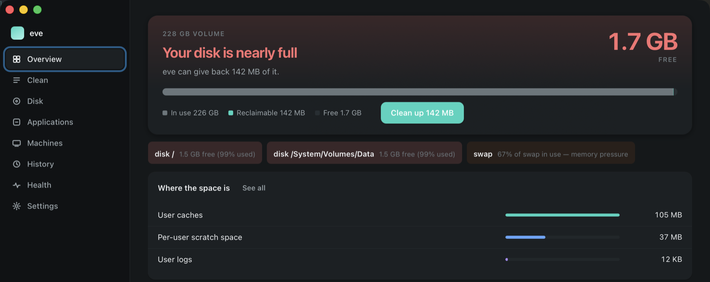
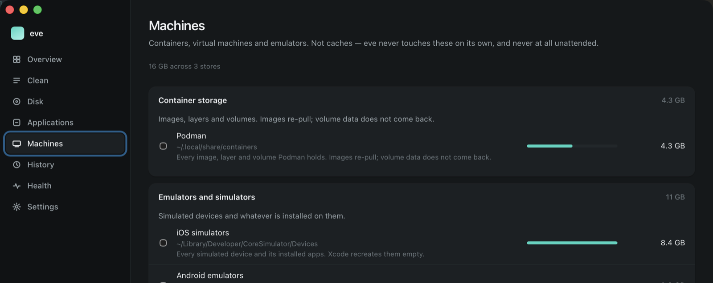

<div align="center">


# eve

**Reclaim disk space on macOS without losing anything you wanted.**

Cleaner, disk analyser, app uninstaller and system monitor. Written in Rust.

[![Badge Licence]][Licence] ![Badge macOS] ![Badge Rust] ![Badge Tests]

---

**[<kbd> <br> Website <br> </kbd>][Site]**
**[<kbd> <br> Install <br> </kbd>][Install]**
**[<kbd> <br> Why it is careful <br> </kbd>][Safety]**
**[<kbd> <br> Support <br> </kbd>][Support]**

---

<!-- funding:begin -->
<p align="center"><strong>Free, and it stays free.</strong> If it saved you an afternoon, this is where you can say so:</p>
<p align="center">
  <a href="https://github.com/sponsors/code-hartle-tech"></a>
  <a href="https://patreon.com/HARTLETECH"></a>
  <a href="https://liberapay.com/hartle.tech/donate"></a>
  <a href="https://ko-fi.com/hartletech"></a>
  <a href="https://wise.com/pay/business/hartletechunipessoallda"></a>
  <a href="https://paypal.me/hartletech"></a>
  <a href="https://buy.stripe.com/5kQ8wR3Wm1sjbKW15E9fW01"></a>
</p>
<!-- funding:end -->



</div>

## What it does

- 🧹 **Reaches what user-level cleaners cannot** — the hibernation image, the unified log store, leftover installer packages, hidden data-volume directories
- 🛡 **Refuses what only looks like cache** — iPhone backups, Photos libraries, anything misfiled
- 🗑 **Trash by default** — and if the Trash is unavailable it *refuses* rather than deleting permanently
- 🔍 **Says where the space really is** — `eve analyze` measures allocated blocks, not the apparent size a sparse file claims
- 📦 **Uninstalls an app and its leftovers** — the bundle plus everything it scattered
- 🔐 **One password, one session** — a root worker over inherited pipes that dies when eve does
- 📓 **An append-only journal** — `eve history` shows everything eve ever removed and under whose authority
- ⏱ **Unattended low-disk cleaning** — a LaunchAgent trigger that cannot reach a dangerous tier

## Install

Download `eve.app`, drag it to **Applications**, open it, and grant Full Disk
Access when it asks. That is the whole setup.

Prefer the terminal? `cargo build --release` — [full instructions][Install].

```
eve clean                 # preview; nothing is deleted
eve clean --execute       # do it
eve clean --privileged    # include the categories that need root
eve analyze ~/Projects    # what is actually using the space
eve uninstall "Some App"  # the app and its leftovers
eve status                # health, volumes, top processes
eve history               # everything eve has ever deleted
eve                       # the interactive TUI
```

## It will not touch these

<div align="center">

</div>

Containers, VMs and simulators are listed, sized and left alone. **eve never
touches them on its own, and never at all unattended** — they take real work to
rebuild, so removing one is your decision, not a heuristic's.

## Docs

| | |
|---|---|
| [eve.hartle.tech][Site] | The site — what it does, with pictures |
| [Install][Install] | The app, the CLI, the privileged extras, and Full Disk Access |
| [Why it is careful][Safety] | The five gates every deletion passes, and the risk tiers |
| [Contributing](CONTRIBUTING.md) | What is worth sending, and the one rule that governs the rest |
| [Security](SECURITY.md) | What counts as a vulnerability here, and where to send it |

## Status

Working: `clean`, `config`, `analyze`, `uninstall`, `installer`, `optimize`,
`status`, `history`, `whitelist`, `autoclean`, the TUI and the `.app`.
**129 tests.**

Planned: an `SMAppService` daemon to replace the sudoers grant entirely.

## Licence

Apache-2.0 · © HARTLE.TECH · [contact@hartle.tech](mailto:contact@hartle.tech) ·
[LICENSE](LICENSE) · [NOTICE](NOTICE)

<!-------------------------------- Links -------------------------------->

[Licence]: LICENSE
[Site]: https://eve.hartle.tech
[Install]: docs/INSTALL.md
[Safety]: docs/SAFETY.md
[Support]: https://github.com/sponsors/code-hartle-tech

<!-------------------------------- Badges ------------------------------->

[Badge Licence]: https://img.shields.io/badge/Apache--2.0-6ee7c4?style=for-the-badge&labelColor=0b0f10
[Badge macOS]: https://img.shields.io/badge/macOS-14+-f5f5f7?style=for-the-badge&logo=apple&logoColor=white&labelColor=0b0f10
[Badge Rust]: https://img.shields.io/badge/Rust-53d8ff?style=for-the-badge&logo=rust&logoColor=white&labelColor=0b0f10
[Badge Tests]: https://img.shields.io/badge/tests-129-6ee7c4?style=for-the-badge&labelColor=0b0f10
